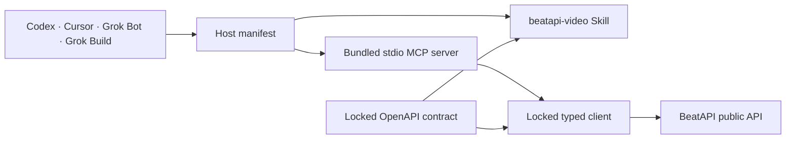

<p align="center">
  
</p>

<p align="center">
  <a href="#quick-start">Quick start</a> ·
  <a href="#model-coverage">Model coverage</a> ·
  <a href="#api-key-and-secret-safety">Security</a> ·
  <a href="#verification">Verification</a>
</p>

# BeatAPI Agent Plugin

For a host-independent onboarding prompt, use
`set up https://beatapi.io/SKILL.md`. The repository root [`SKILL.md`](SKILL.md)
mirrors that setup contract; the detailed installable Skill remains under
`skills/beatapi-video/`.

A cross-host Agent Toolkit plugin for discovering live BeatAPI models and
running text, image, video, Effect, analysis, and production workflow
APIs through one local MCP interface.

The repository packages the same canonical `beatapi-video` Skill, bundled MCP
server, typed client, and locked OpenAPI contract for four agent surfaces:

| Host | Plugin metadata | MCP configuration | API key path |
| --- | --- | --- | --- |
| Codex | `.codex-plugin/plugin.json` | `.mcp.json` | BeatAPI CLI credential manager or host environment |
| Cursor | `.cursor-plugin/plugin.json` | `mcp.json` | Plugins → Configure |
| Grok Bot | Same Cursor account plugin | `mcp.json` | Plugins → Configure |
| Grok Build | `.grok-plugin/plugin.json` | `.mcp.json` | BeatAPI CLI credential manager or host environment |

Marketplace acceptance is a separate review step. The presence of a manifest
in this repository does not mean a listing is already live.

## Quick start

1. Create a key in [Dashboard → API Keys](https://beatapi.io/dashboard/apikeys).
2. Install the plugin for your host using one of the paths below.
3. Configure the key outside the conversation. For local uploads, also set
   `BEATAPI_UPLOAD_ROOTS` to directories containing files you selected.
4. Ask the agent to discover current models before creating a paid task.

For example:

```text
Use $beatapi-video to list current video models, choose one that supports image
references, and create a 10-second 9:16 product shot from these images.
```

Requirements: Node.js 20.19+ or 22.12+, a BeatAPI account, and network access to
`https://api.beatapi.io`.

## Install on Cursor and Grok Bot

Cursor and Grok Bot share the same Cursor Marketplace plugin and account-level
configuration. For local review on macOS or Linux, link this checkout and reload
Cursor:

```bash
ln -s /absolute/path/to/beatapi-agent-plugin \
  ~/.cursor/plugins/local/beatapi-agent-plugin
```

Open **Customize → Plugins → BeatAPI → Configure**, then set
`BEATAPI_API_KEY`. Add `BEATAPI_UPLOAD_ROOTS` only when you need local uploads;
use colon-separated absolute directories on macOS/Linux or semicolon-separated
directories on Windows. Keep the default `BEATAPI_BASE_URL`; a support-provided
custom HTTPS origin also requires `BEATAPI_TRUST_CUSTOM_BASE_URL=1`.

## Install on Grok Build

Validate and install a source checkout with the current Grok Build CLI:

```bash
npm ci
npm run verify
grok plugin validate .
grok plugin install .
```

The recommended credential path is the operating-system credential manager:

```bash
npm install --global beatapi@0.2.0
beatapi auth login
export BEATAPI_CLI_PATH="$(command -v beatapi)"
```

The reviewed npm integrity for `beatapi@0.2.0` is
`sha512-7a7XF/tCc5u2p/ZnonSkLq1JF4OPpv3yaj7mFqnQcK9/HjOtj5hMny5bax4VcTbjgHRfDc1QlFXSbF3tzIL19Q==`.

Alternatively, export the key only in the shell that launches Grok Build:

```bash
read -s BEATAPI_API_KEY
export BEATAPI_API_KEY
printf '\n'
grok
```

## Install on Codex

Build and add the repository-local marketplace:

```bash
npm ci
npm run verify
codex plugin marketplace add ./dist/marketplace
codex plugin add beatapi-agent-plugin@beatapi-local
```

Then run `beatapi auth login` and set `BEATAPI_CLI_PATH` to the CLI's absolute
executable path, or set `BEATAPI_API_KEY` in the environment that launches
Codex. Restart the desktop app after installation.

## Model coverage

Model IDs are discovered at runtime rather than hardcoded into the plugin:

| Surface | Discovery | Stable execution interface |
| --- | --- | --- |
| Text models | Authenticated `GET /v1/models` | Non-streaming `POST /v1/responses` with the selected model ID |
| Image models | Public `GET /v1/media/models` | `beatapi_create_image({ model, parameters })` |
| Video models | Public `GET /v1/media/models` | `beatapi_create_video({ model, parameters })` |
| Effects | Public list and detail endpoints | Versioned Effect task creation |
| Workflows | Public `GET /v1/workflows` | Music Video, Ecommerce Video, Video Analysis, and Realtime tools |

The generic image and video tools accept a current model ID plus its
model-specific `parameters`. New models can therefore appear in discovery
without requiring a new plugin release. The bundled OpenAPI snapshot remains the
source for each model's supported fields and constraints.

## What the plugin can do

- discover text models, image/video model aliases, workflows, and published
  Effects;
- create non-streaming text responses when the user explicitly requests
  BeatAPI text generation;
- create image, video, Effect, Video Analysis, Music Video, and Ecommerce Video
  tasks;
- upload explicitly selected local images, audio, MP4/MOV video, and SRT files
  from configured trusted directories;
- inspect, edit, materialize, and compose Music Video storyboard shots;
- inspect and close existing short-lived Realtime Video sessions;
- poll asynchronous tasks until a terminal or actionable state;
- inspect USD balance, usage, and active concurrency;
- inspect, update, and delete existing webhook endpoints.

The MCP server exposes 26 focused tools. Paid mutations are labeled as such;
read-only and destructive annotations are set independently.

Realtime-session and webhook creation return one-time secrets. Those two create
operations are intentionally not exposed to an agent until a host secret broker
can keep both the secret and its retrieval handle outside model authority. Use
trusted server-side application code or the BeatAPI dashboard for that setup.

## API key and secret safety

Never paste an API key into a prompt. The plugin excludes credential fields and
recursively rejects credential-shaped values in open-ended model parameters.

- Cursor and Grok Bot inject declared variables from the plugin configuration
  screen.
- Codex and Grok Build can use `beatapi auth login` or inherit
  `BEATAPI_API_KEY` from the launching process.
- Responses are recursively sanitized for credential-like fields and bearer
  values.
- Local uploads are disabled until `BEATAPI_UPLOAD_ROOTS` is configured, then
  canonical paths are confined to those trusted directories and symlinks are
  rejected.
- One-time-secret creation operations are not exposed through this agent
  package.
- The default endpoint is `https://api.beatapi.io`; overrides must be exact
  HTTPS origins without credentials, paths, queries, or fragments and require a
  separate explicit operator trust flag.

## Architecture



The host-specific manifests are thin adapters. Product behavior stays local to
the shared Skill, MCP server, typed client, and contract, so fixes do not drift
across separate repositories.

## Package layout

| Path | Purpose |
| --- | --- |
| `.codex-plugin/plugin.json` | Codex presentation and component manifest |
| `.cursor-plugin/plugin.json` | Cursor and Grok Bot metadata and variable declarations |
| `.grok-plugin/plugin.json` | Grok Build marketplace metadata |
| `.mcp.json` | Codex and Grok Build local stdio configuration |
| `mcp.json` | Cursor and Grok Bot stdio configuration with variable placeholders |
| `mcp/server.mjs` | Dependency-free bundled MCP runtime |
| `skills/beatapi-video/` | Synchronized canonical BeatAPI Skill |
| `contract/` | Locked BeatAPI OpenAPI snapshot and provenance |
| `generated/` | Skill and typed-client provenance locks |

Do not edit synchronized Skill or client files directly. Refresh them through
`npm run skill:sync` and `npm run runtime:sync`.

## Publishing paths

1. **Cursor Marketplace and Grok Bot:** submit this public repository once at
   `https://cursor.com/marketplace/publish` after owner review and merge.
2. **Grok Build Marketplace:** add a SHA-pinned entry for this public repository
   to `xai-org/plugin-marketplace` and regenerate its component index.
3. **Codex local marketplace:** `npm run marketplace:build` creates an
   installable marketplace and ZIP under `dist/`.
4. **OpenAI Plugin Directory:** `npm run submission:build` creates the separate
   Skills-only review artifact. It does not claim a hosted HTTPS MCP server.

See [submission/SUBMISSION.md](submission/SUBMISSION.md) for the separate public
directory review boundary.

## Verification

```bash
npm run verify
python3 ~/.codex/skills/.system/plugin-creator/scripts/validate_plugin.py .
grok plugin validate .
```

Verification covers OpenAPI drift, synchronized Skill/client sources, Cursor
and Grok manifests, TypeScript, MCP protocol behavior, credential rejection and
redaction, upload-root confinement and size limits, deterministic bundles, and
release packaging.

## Contributing

Issues and pull requests are welcome. Please keep new claims tied to executable
source, tests, or the current public OpenAPI contract, and run `npm run verify`
before opening a pull request.

## License

MIT
